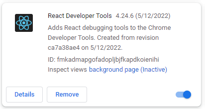
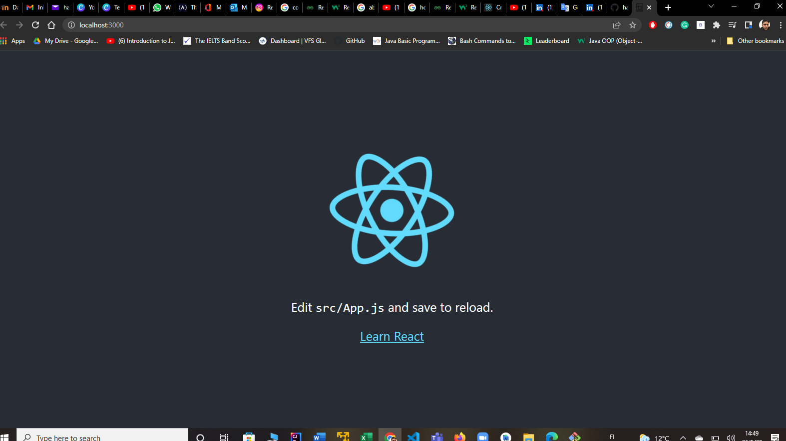
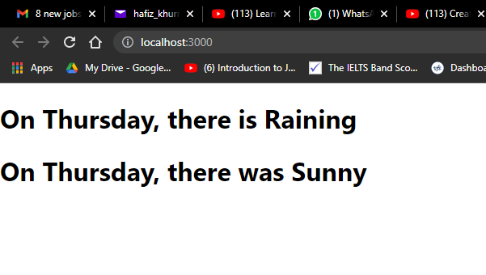
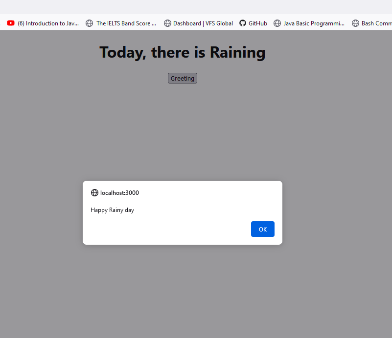

# React Documentation for WeatherApi Application

# 1. React Basics
 ### 1. What is React.js?

React is a Facebook-developed FrontEnd JavaScript Library which is being used widely to make a larger application. The aim of using React is to make the Visual Interfaces simple. React allows its developers to perform CRUD tasks without realoding the page. React is being used by the companies like facebook, Netflix, Instagram etc.

 ### 2. Setup tools for React App
 
 #### The following tools required to use React Journey
 - VS Code (Code Editor to write the code)
 ##### VS Code Extensions:
  - ThunderClient to use as testing API like Postman.
  - ES7 React / Redux Snippets to write the code quickly as this extension provides code snippets.
  - Bracket Pair Colorizer, this extension provides the help to check the brackets by using the same color scheme of starting and ending the bracket.
  - Auto Rename Tag, This extension provides the help to change the name of the tag by changing the name of only the starting tag but ending tag changes automatically
 ##### Chrome Extensions:
 - React Dev tools (Chrome Extension to visualize the React result better) as shown in the fig.
  
 ###### For Backend:
 - Node Js (To execute JS without using browser)

### 3. What is React JSX?

JXS is actually a syntax extension in JS which allows developers to write HTML inside React. JSX is the abbreviation of JavaScript XML. The example of JSX is as follows:

```javascript
const languages= (
<ul>
 <li> Java </li>
 <li> PHP </li>
 <li> Scala </li>
 </ul>
 )
```
In JavaScript, class is reserved keyword, so that developers must use className to execute the JSX like as follows:

```javascript
const greet = <h1 className = "greetings"> Hello </h1>

```

### 4. What are components in React?

In fact, Every thing is component in React. To explain the concept, we can say in simple words that the component is an isolated piece of interface. In the application, Navbar, Sidebar etc are all components. These components are made separately and join together and as a result, one React Application completes.

#### Types of Components:
In React, there are two types of components.
- Function based component
- Class based component

#### Function based component:

The function based component is basically a JavaScript function that returns HTML, which is JSX. The example is:

```javascript
function Clock = () => {
   return <h1> Clock is Important </h1>
}
```

#### Class based component:

The class based components are typically JavaScript class which extends React.Component. Here is the example

```javascript

import React, { Component } from 'react'

class Clock extends Component {
render(){
return <h1> Clock is Important </h1>
}
}

```

### 5. How to create a new React App?

In ordert to create a new react app, one should follow certain steps and then, we get folder package in our local machine from the React. At first we should run the following command in the PowerShell terminal of VS Code:

```bash
npx create-react-app weatherapi
```

By executing the above command, we get a full package automatically from the React in the selected location and to start the installed project, we should change directory, if the seected location is different by run the following command:

```bash
cd weatherapi
```

Once everyting is open and ready to start work in code Editor (VS Code), we should write the following command to start the first default React app.

```bash
npm run start
```
After successfully execution of the app, we will get the result like this as given below:



In this way, we create a new React app and later, certainly we customize the folders and files include in the package as per our need.


# 2. React State and Events

### 1. What is the React State?

In simple words, State is built-in React Object to store data about the component. The stored value varies in state, the component renders again. It is a private Object which cannot be accessed outside the class. Actually, it acts as a variable and can be used where we want.

### 2. Demo of State in React

In the demonstration of state, we must have a constructor as this would be used to call the default state. The exmaple is shown in the given below:
```javascript

import React, { Component } from 'react'

export default class Weather extends Component {

    constructor(){
        super();
        this.state = {
            day : 'Thursday'
            
        }
    }
  render() {
    return (
      <div>
        <h1> On {this.state.day}, there is Raining</h1>
      </div>
    )
  }
}


```

In this way, we can call the state and the value changes accroding to the component. There is also possibility to set several states at the same time and 'this' keyword uses to call the required set state as shown:

```javascript

import React, { Component } from 'react'

export default class Weather extends Component {

    constructor(){
        super();
        this.state = {
            day : 'Thursday',
             yesterday: 'Wednesday'
            
        }
    }
  render() {
    return (
      <div>
        <h1> On {this.state.day}, there is Raining</h1>
        <h1> On {this.state.day}, there was Sunny</h1>
      </div>
    )
  }
}


```

The result of these codes can be shown in the image



### 3. What is an event?

Event in React is defined as an action, which is being triggered by a user action. There are several events in the React which is being used as a result of triggered. Few of them are as follows:

| Mouse | Composition | Clipboard | Media |
| --- | --- | --- | --- |
| onClick | onCompositionEnd | onCopy | onAbort|
| onContextMenu | onCompositionStart | onCut | onCanPlay |
| onDoubleClick | onCompositionUpdate | onPaste | onCanPlayThrough |

### 4. Event Handling in React

As far as handling events concerned in React, there is a function need to be called inside the event in the component class. It is named as Camel Case instead of lower case letters like onClick, onCut, onPaste etc. The following code is the representation of events handling in the React. Events are being hanlded different in the class based components and function based components. Below is the example of function based component event handler.

```javascript
const test = () => {
alert ('This is test')
}
<button onClick={test}>Click Me</button>
```

Here is the event being handled in the class based component.

```javascript
test () {
 alert ('This is test')
}
<button onClick={() => this.test()}>Click Me</button>
```

### 5. Demo of React Events

The demonstration of the events being handled in the React is given as:

```javascript
import React, { Component } from "react";
import "./App.css";

export default class Weather extends Component {
  handleWeather() {
    alert("Happy Rainy day");
  }
  render() {
    return (
      <div className="App">
        <h1> Today, there is Raining</h1>
        <button onClick={() => this.handleWeather()}>Greeting</button>
      </div>
    );
  }
}
```

The result of the above code is given in the following scrennshot



